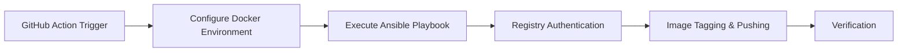

# Docker Image Sync with GitHub Actions and Ansible

## Overview
This project provides a complete YAML-based solution for synchronizing Docker images between different registries. Implemented using GitHub Actions for workflow orchestration and Ansible for infrastructure provisioning, it enables reliable image synchronization while supporting both secure (HTTPS) and insecure (HTTP) registry configurations.

## Key Features
✅ **Pure YAML Implementation** - Entire workflow defined in declarative YAML files
✅ **GitHub Actions Integration** - Automates synchronization workflows
✅ **Ansible Powered** - Manages infrastructure configuration and image operations
✅ **Registry Flexibility** - Works with HTTP/HTTPS registries (Docker Hub, GHCR, private registries)
✅ **Idempotent Operations** - Safe for repeated execution
✅ **Authentication Support** - Handles secured registries with credential management

## Workflow Architecture

## Getting Started
1. **Configure Registries**
   Edit `config/images.yml` with your source and target registry details
   Encrypted your vault.yml and put them into `config/vault.yml`

3. **Set Credentials**
   Add VAULT credentials as GitHub Secrets:
   - `ANSIBLE_VAULT_PASSWORD`

4. **For HTTP Registries**
   Add registry host:port to insecure registries:
   - `vault_registry_url: "http://registry.example.com:5000"`

5. **Trigger Workflow**
   Manually trigger through GitHub UI or configure schedule in `sync-images.yml`

## Supported Environments
- GitHub-hosted runners (Ubuntu)
- Self-hosted runners
- Private Docker registries (Artifactory, Harbor, Nexus)
- Cloud registries (ECR, GCR, ACR)

## Security Notes
- All credentials handled through GitHub Secrets
- Ansible Vault integration for sensitive data encryption
- HTTPS recommended for production registries

## Contribution
Contributions no welcome! Please don't submit PRs for:
- Additional registry support
- Improved error handling
- Performance optimizations
Because Neboer is steeeeeeamed breeeeeead...

---

**License**: MIT
**Maintainer**: Infrastructure Team
**Status**: Production Ready
